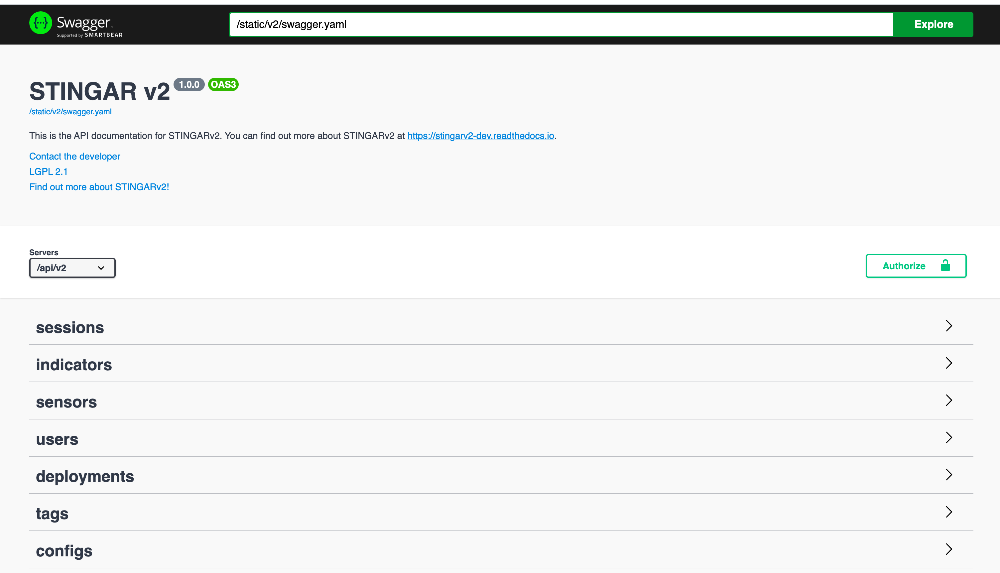

STINGAR API
===========

The STINGAR API is available through Swagger which describes each API query. The STINGAR Swagger page is available by entering your host server url with the prefix <span style="color:blue;">/api/v2#/</span>

You must provide your API_KEY to use the STINGAR API. This key was created when you ran the QuickStart script and is stored in the stingar.env file in STINGAR's root directory. Grab that key from the stingar.env file (It looks something like this: API_KEY=Rp9U4erhgej5V2QfCpxSrA). To use Swagger, press the <span style="color:green;">[Authorize]</span> button in the upper right side of the Swagger page and enter the key at the prompt.



Alternatively, you can retrieve the API key from the UI's User Management feature by logging in as 'admin' user and selecting 'View Your API Token' from the [Actions] dropdown on the User Management page.

You can also retrieve the token by querying the stingar database.

```
docker-compose exec stingarapi sqlite3 /srv/db/stingar.db "SELECT token FROM users WHERE username='admin'"
```
