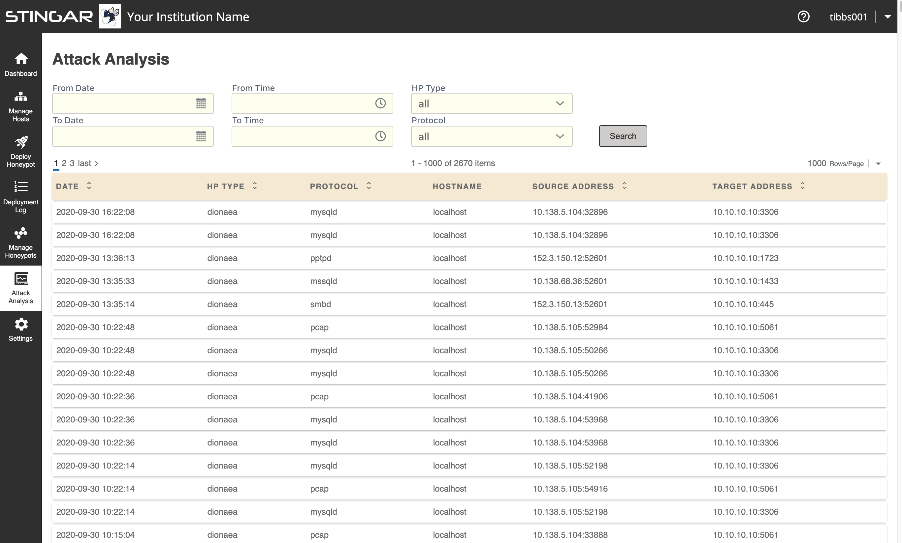

Attack Analysis- User Interface
===============

The STINGAR user interface includes a page that lists all honeypot attack events and allows you to select and inspect each one. You may filter the list of events using a number of search criteria.

