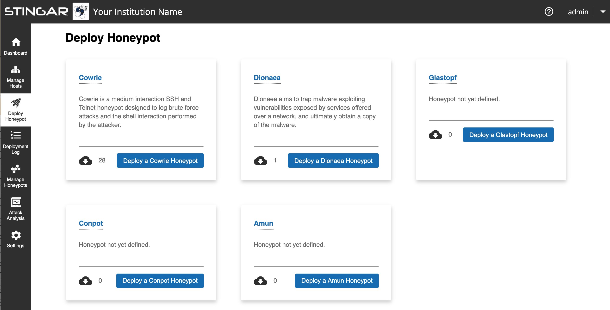
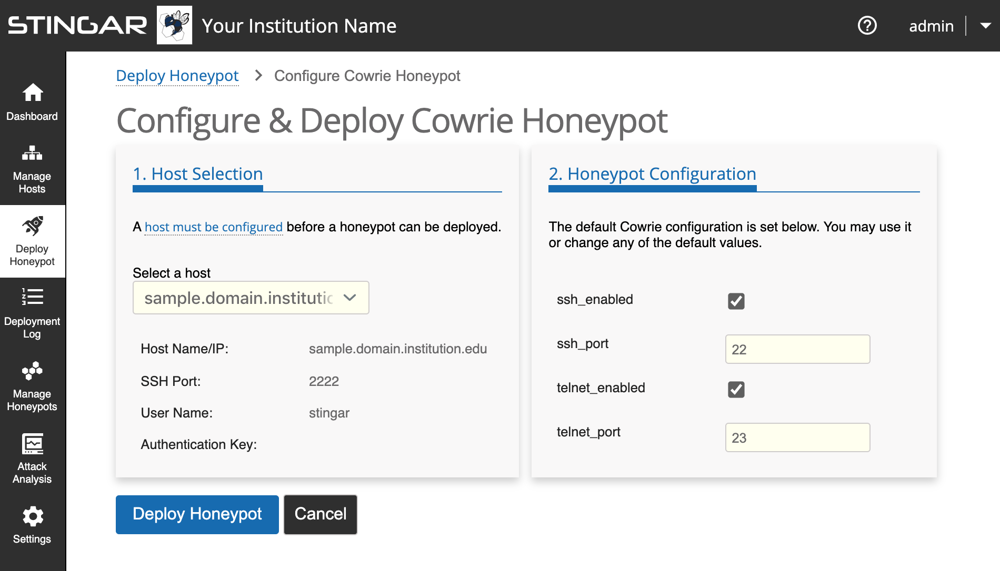
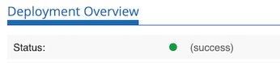

Deploy a Honeypot
===============

Once you've setup a server to host a honeypot (see instructions [here](../prepare_hp_host/register_in_stingar.md) if you haven't yet setup a host), you can now deploy a honeypot. Click <b>[Deploy Honeypot]</b> on the sidebar to open the 'Honeypot Deployment' page as shown below:

<h3>Select Honeypot Type</h3>

Currently, 5 types of honeypots are available to deploy via STINGAR: Amum, Conpot, Cowrie, Dionaea & Glastopf. On this 'Deploy Honeypot' page, a card appears for each one that briefly describes the honeypot and displays the number of instances you currently have running. Click the button for the honeypot you want to deploy. In this example, we are deploying a Cowrie honeypot, so when we click on <b>[Deploy a Cowrie Honeypot]</b>, the following screen should appear:

<h3>Select Host</h3>

In the left pane select the server that will host this honeypot. (If only one host has been created in STINGAR, it will be selected by default.) Information about that host will display below the host dropdown entry.

<h3>Configure Honeypot</h3>

The right pane displays the configurable settings for the given honeypot type. The settings are pre-populated with default values which can be changed. Configuration options are unique to each type of honeypot.

<h3>Deploy Honeypot</h3>

Once you have identified the host & are satisfied with the configuration settings, press <b>[Deploy Honeypot]</b> in the lower left to initiate the deployment process.

Once deployed, a page summarizing this deployment event will appear that includes a log that keeps a running update on the progress of the deployment, logging each step taken. If an error is encountered and the honeypot fails to deploy, the cause of the problem will be reported under the 'errors' section of the deployment log table.

The honeypot has been successfully deployed when the status icon turns green and the word 'success' appears next to it.

