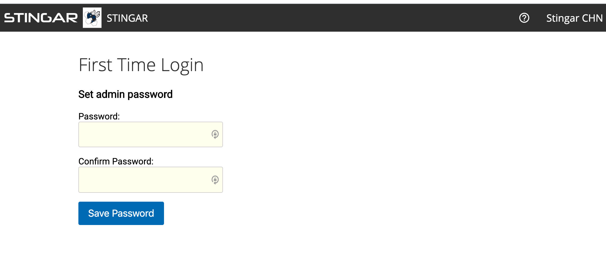
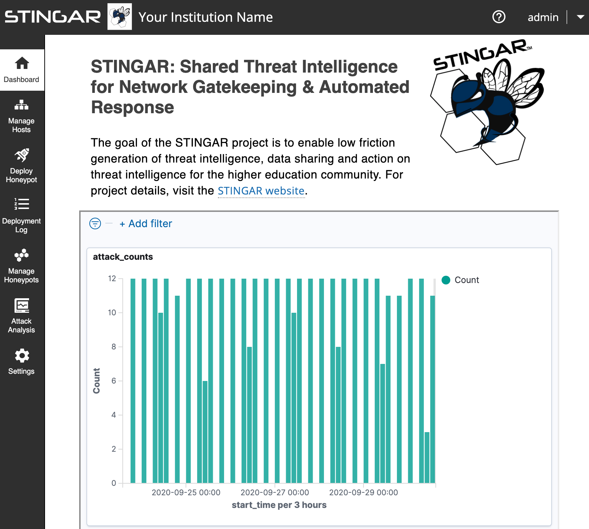

<h1>Launch STINGAR</h1>

With STINGAR downloaded & configured (assuming you're logged on to the server as the STINGAR user in the 'stingar' directory where it resides) enter:

```
docker-compose up -d
```

It can take up to 15 minutes to startup the first time. Monitor progress with this command:

```
docker-compose logs -f stingarui
```

STINGAR is ready when the log output stops scrolling & you see:

<ul style="border:solid 1px;border-radius:3px;padding:.4em;">
  <li style="list-style:none;">stingarui_1      | * Environment: production</li>
  <li style="list-style:none;">stingarui_1      | * Listening on tcp://0.0.0.0:3000</li>
  <li style="list-style:none;">stingarui_1      | Use Ctrl-C to stop</li>
</ul>

<h4>Access STINGAR From a Browser</h4>

You may access STINGAR by entering the URL or domain name of your host machine into a browser. <b><u>You must prefix your STINGAR hostname with <span style="font-size:large;"> https://</span></u></b>

In the initial browser view, you'll likely see a message about a potential security risk that recommends you 'Go Back'. Assuming you installed certs and self-signed your application, it's safe to proceed & press the [Advanced...] button.

An example of the warning in Firefox:


<h4>STINGAR Admin User</h4>

STINGAR provides an <b>'admin'</b> user which lets you login to the application. (This is not the same as the linux user you used to logon to the server.)</b> The first time you login, you'll need to set the password:



Once the password is set, the STINGAR UI dashboard appears.



Congrats! You have successfully installed STINGAR.

<h4>Deploy a Honeypot</h4>

Proceed to the next step to deploy a honeypot. You need another ubuntu server to host a honeypot. Ubuntu is currently the only operating system STINGAR supports for hosting honeypots. You cannot install honeypots on the same server used to host STINGAR.


