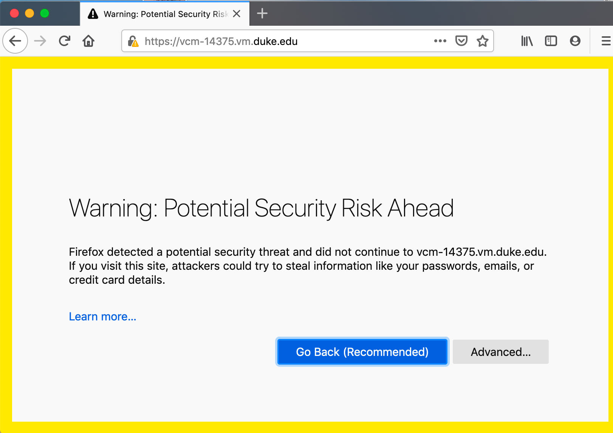
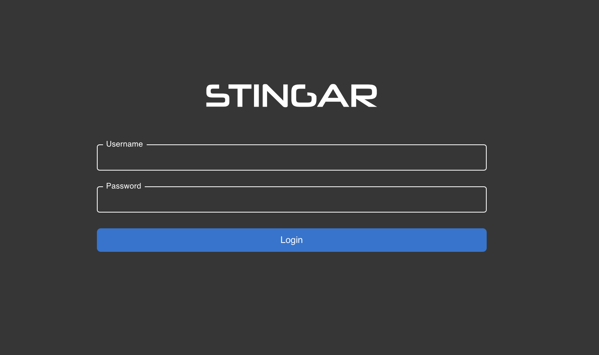
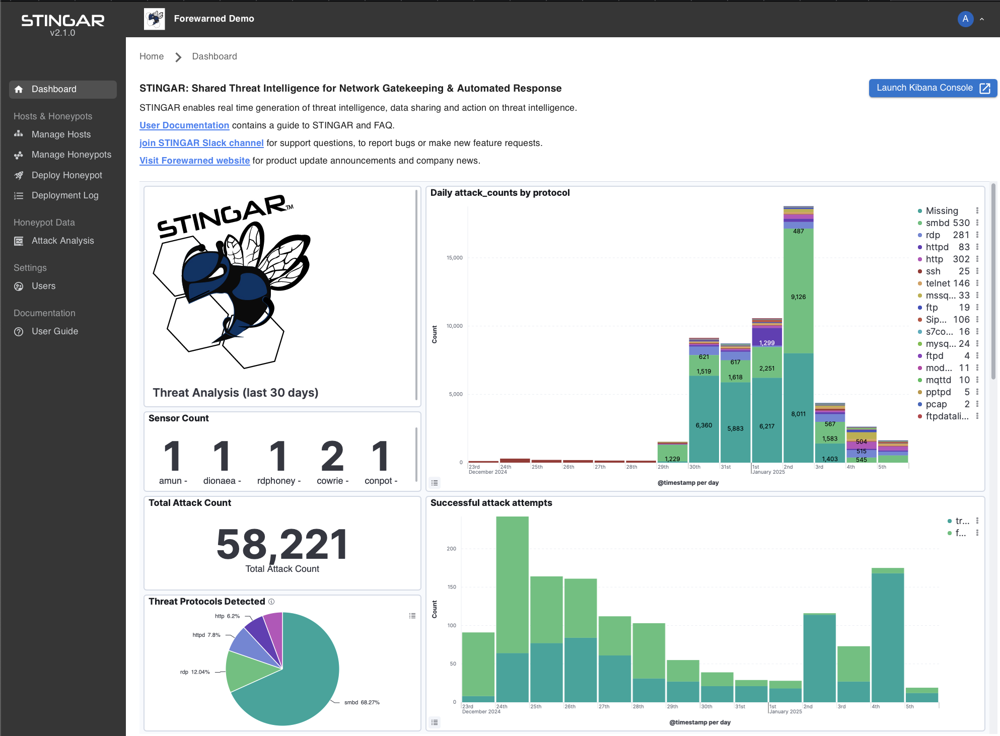

<h1>Launch STINGAR</h1>

With STINGAR downloaded & configured (assuming you're logged on to the server as the STINGAR user in the 'stingar' directory where it resides) enter:

```
docker-compose up -d
```

It can take up to 10 minutes to startup the first time. Monitor progress with this command:

```
docker-compose logs -f stingarui
```

STINGAR is ready when the log output stops scrolling & you see:

<ul style="border:solid 1px;border-radius:3px;padding:.4em;">
  <li style="list-style:none;">stingarui_1      | > stingar@2.1.0 start</li>
  <li style="list-style:none;">stingarui_1      | > next start</li>
  <li style="list-style:none;">stingarui_1      | </li>
  <li style="list-style:none;">stingarui_1      |    ▲ Next.js 15.1.4</li>
  <li style="list-style:none;">stingarui_1      |    - Local:        http://localhost:3000</li>
  <li style="list-style:none;">stingarui_1      |    - Network:      http://172.20.0.3:3000</li>
  <li style="list-style:none;">stingarui_1      | </li>
  <li style="list-style:none;">stingarui_1      |  ✓ Starting...</li>
  <li style="list-style:none;">stingarui_1      |  ✓ Ready in 646ms</li>
</ul>

<h4>Access STINGAR From a Browser</h4>

You may access STINGAR by entering the URL or domain name of your host machine into a browser. <b><u>You must prefix your STINGAR hostname with <span style="font-size:large;"> https://</span></u></b>

In the initial browser view, you'll likely see a message about a potential security risk that recommends you 'Go Back'. Assuming you installed certs and self-signed your application, it's safe to proceed & press the [Advanced...] button.

An example of the warning in Firefox:



<h4>STINGAR Admin User</h4>

STINGAR provides an <b>'admin'</b> user which lets you login to the application. (This is not the same as the linux user you used to logon to the server.)</b> The first time you login, you'll need to set the password:



Once the password is set, the STINGAR UI dashboard appears.



Congrats! You have successfully installed STINGAR.

Proceed to the <b>User Guide</b> documentation contained within your STINGAR installation (see bottom left menu "User Guide" from on Dashboard) to take the next steps to deploying your honeypot network and connecting to the shared threat feed. 

