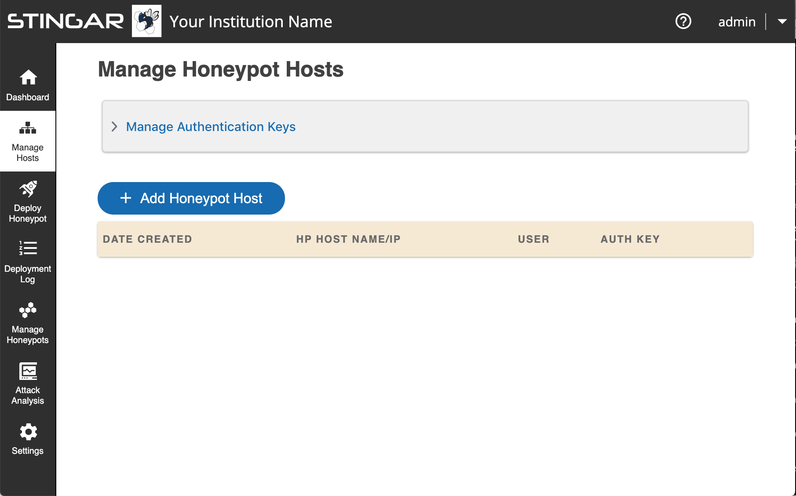
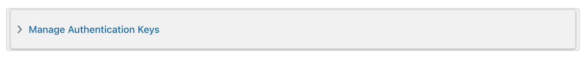
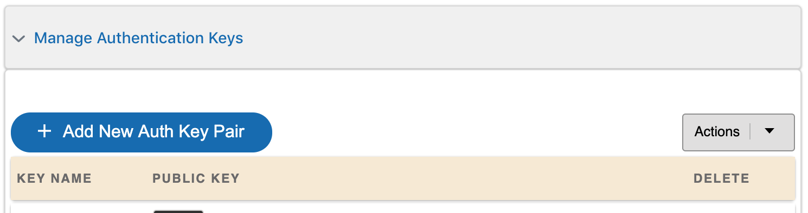
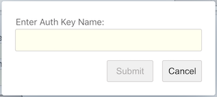
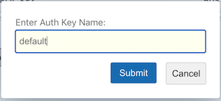
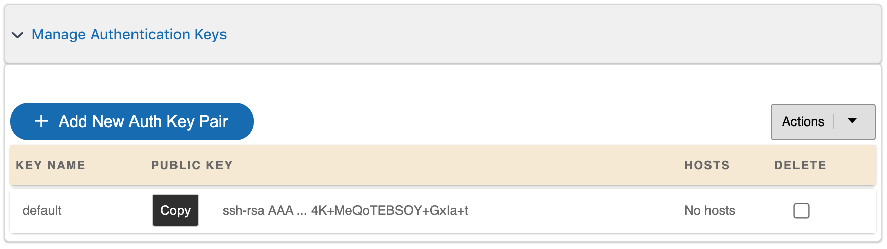
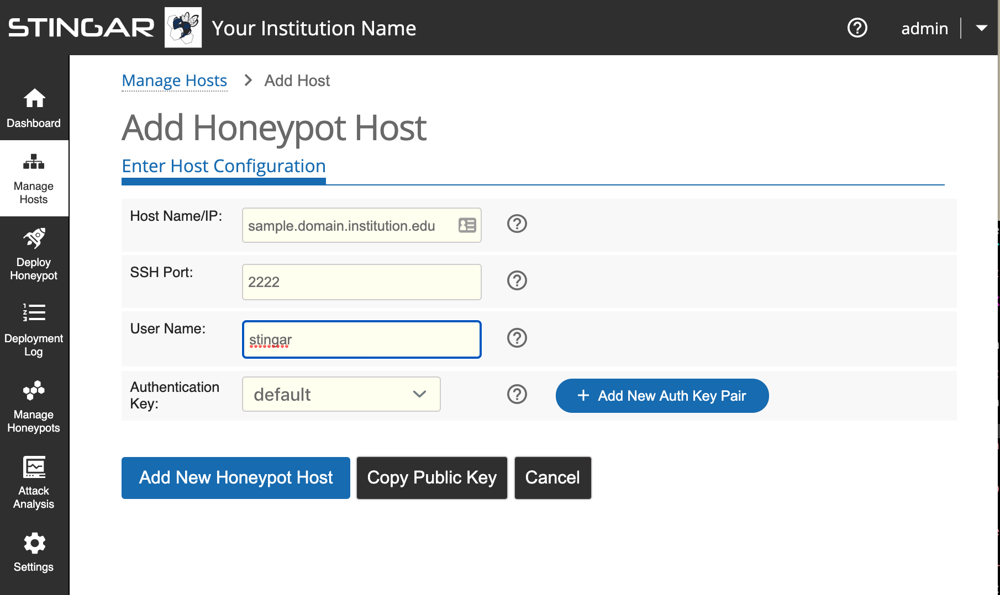
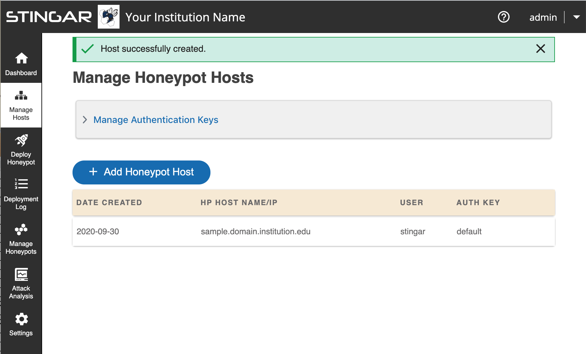
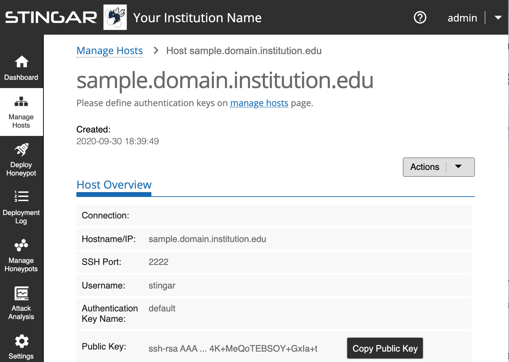

Prepare Honeypot Host Machine
=================

<h3>You must have root access on an ubuntu 18.04 server to host a honeypot.</h3>

Currently, honeypots can only be hosted on <b>ubuntu 18.04</b>; one honeypot per server. You need the following info:

*  The IP address or domain name of the machine that will host the honeypot.
*  The username with root access that is used to access this machine.
*  A non-standard port number for ssh communications. (Something other than 22.)

<h3>Register your honeypot host machine in STINGAR.</h3>

<h4>1. Go to 'Manage Hosts' Section in STINGAR</h4>

Login to your STINGAR app & select <b>[Manage Hosts]</b> in the left sidebar. (If you haven't installed STINGAR yet, see the section: <b>[Install STINGAR](../install/run_quickstart.md)</b>.)

<h4>2. Create Authentication Key</h4>

Create an authentication key. This key will be copy/pasted to the host machine in the next section. Click anywhere in the <b>'Manage Authentication Keys'</b> bar at the top of the page.

This section will expand to show the <b>[+ Add New Auth Key Pair]</b>. Click this button to create a new key & give it a name that helps you identify this key.

Press <b>[Submit]</b> & an authentication public/private key pair will be created with the name you provided. The new key will appear in the auth key list.

<h4>3. Define your Honeypot Host</h4>

Press the <b>[ + Add Honeypot Host]</b> button to enter information about your host. The screenshot below shows an example of registering host vcm-15556.vm.duke.edu for username vcm, and assigns the '<i>default</i>' auth key to communication on port 2222.

When you press <b>[Add New Honeypot Host]</b>, your host will appear in the list of hosts.

If all went well, your honeypot host is registered in STINGAR. You now need to logon to the actual honeypot host machine to configure it to communicate with STINGAR. The next section describes the steps required. You'll need the info you just entered into STINGAR, so click on the host to open a page to show the info you need to setup the machine.

