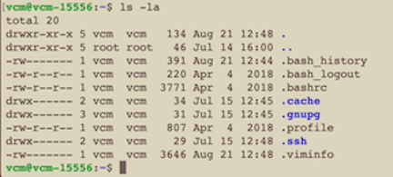
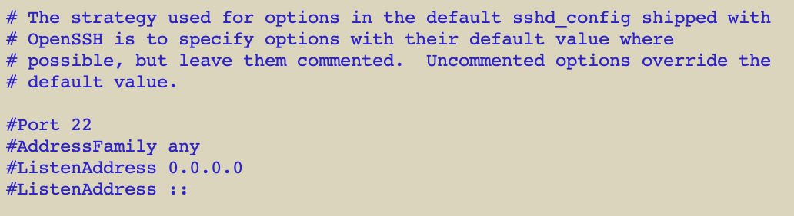
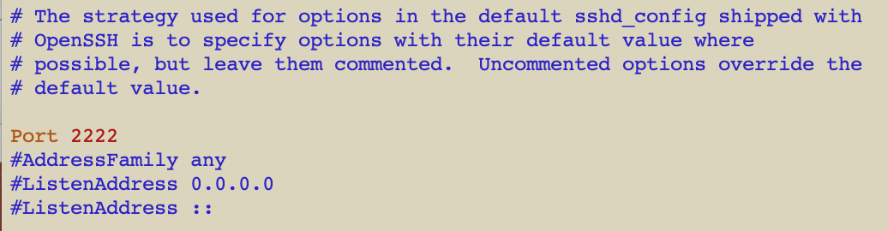

Prepare Honeypot Host Machine
=================

You must do 4 things by hand on your honeypot host machine:

1.  Setup password-less sudo.
2.  Verify you have ssh setup in your root directory.
3.  Add the STINGAR authentication key to ~/.ssh/authorized_keys .
4.  Configure the ssh port using the port number you specified in STINGAR. (Something other than 22.)

Logon to your host machine as the user you specified in STINGAR. (Use putty on Windows or a terminal session on linux or Mac.) Sample login command:

```
ssh stingar@sample.domain.institution.edu
```

<h6>Step 1. Setup password-less sudo.</h6>

Setup the user so you can run sudo commands without entering a password:

```
sudo visudo
```

This should open a file that contains the line: <b>{username} ALL=(ALL) NOPASSWD:ALL</b> where {username} is a name. Replace the {username} value with the name of your honeypot user.


<h6>Step 2. Verify you have ssh setup in your root directory.</h6>

To see if ssh is setup, list the content of your root directory.

```
 cd
 ls -la
```



If .ssh doesn't appear in the list (as it does in the image above) you need to create this directory & add the <i>authorized_keys</i> file with correct permissions by running the following commands. If it's already setup, skip to step 3.

```
mkdir .ssh

chmod 700 .ssh

touch ~/.ssh/authorized_keys

chmod 600 ~/.ssh/authorized_keys
```

<h6>Step 3. Add the STINGAR-generated public key to ~/.ssh/authorized_keys.</h6>

Now that the <i>.ssh/authorized_keys</i> file exists, open it to copy/paste in the authorization key you created in STINGAR earlier. Use the file with an editor of your choice. You can use the <i>vi</i> editor if you're familiar with it. If not, you probably want to use the <i>nano</i> editor. We will assume you're using nano for the next few steps.

Open the authorized_keys file:

```
nano ~/.ssh/authorized_keys
```

Back in the browser, on the STINGAR 'Show Host' page... press the <b>[Copy Public Key]</b> button.


 This quietly saves the key to your clipboard. Return to the .ssh/authorized_keys file & press <b>ctrl-v</b> to paste it into the file. Save the file and quit by entering: <b>ctrl-o [Return] ctrl-x</b>

<div style="border: solid;padding: 1em;">
<b>Note:</b> The honeypot host machine must have the same key assigned to it in STINGAR or they will not be able to communicate with each other.
</div>
</br>

<h6>Step 4. Setup a non-standard ssh port.</h6>

Tell your honeypot host the port number to use for ssh communications. (This must be the port number you entered for this host in STINGAR.) Open the <i>/etc/ssh/sshd_config</i> file, uncomment the line: <b>#Port</b> and enter the number you defined for this host in STINGAR. This requires root access, so prefix the command with <i>sudo</i>.
```
sudo nano /etc/ssh/sshd_config
```

The <i>/etc/ssh/sshd_config</i> file:

before edit



after edit (assuming you've defined ssh port to be 2222)


Once updated, restart ssh:

```
sudo systemctl restart ssh
```

Your host machine is now ready to communicate with STINGAR. You may logout of the server (enter 'exit' at the command prompt).

