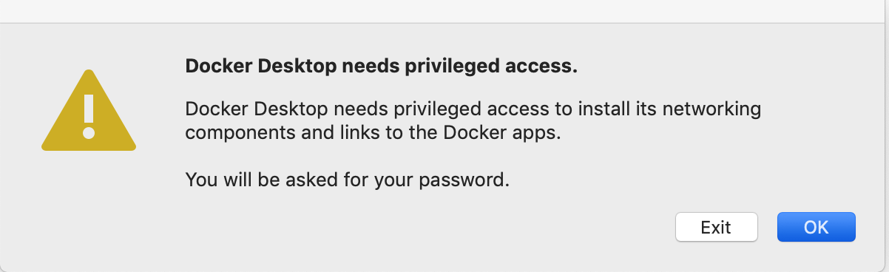
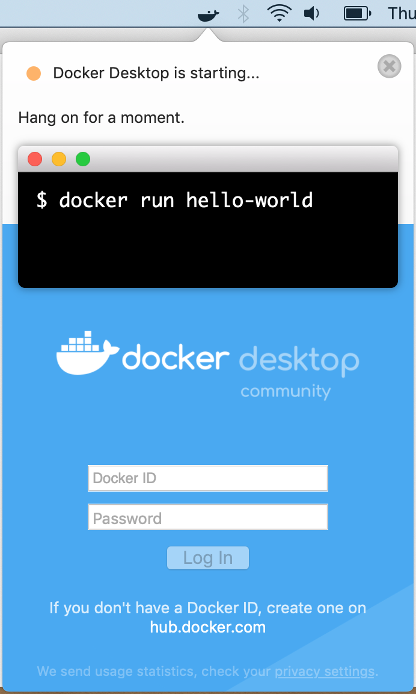

STINGAR System - MacOS Installation
===============

This page describes how to install software that STINGAR needs to run on a MacOS server. The server must be at MacOS Mojave 10.14.6 or higher and you must login as a user with root privilege. Because Docker is a system-level package, you cannot install it using brew install. You must use cask instead.

#Install Docker & Python

Log onto the MacOS server as the STINGAR user (with root privs); then install & launch the software required to setup & run STINGAR.

```
brew update
brew cask install docker docker-compose python3 pass ```
Launch Docker by entering [Cmd][Space] and typing the word 'Docker' in the prompt.



Click [OK] and enter the root password to proceed. When Docker starts installing, a whale icon will appear in the top bar on the right. Click it to see the current status of Docker.  When you see 'Docker Desktop is running" you're ready to move forward!



<style>
button {
  color: #ffffff;
  background-color: #2f75bc;
  padding: .5em .8em;
  border-radius: 3px;
  border: none;
}
button:hover {
  background-color: #757475;
}
a {
  color: white;
}
a:visited, a:hover {
  color: white;
}
</style>

<button style="margin-top:3em;float:right;">[Proceed to Next Step](confirm.md)</button>

